# 🔥 Rap Scraper & Analyzer - PostgreSQL + pgvector Hip-Hop Data Pipeline

> **Production-ready lyrics collection and analysis platform: Scrapes artists from Genius.com, enriches with Spotify metadata, and analyzes with AI models. PostgreSQL + pgvector architecture supporting concurrent processing and vector similarity search of 57K+ tracks.**

## 🎯 Enterprise Features

### 🕷️ Data Collection Engine
- **Genius.com Scraper**: Automated artist and lyrics collection with 345+ artists
- **Spotify API Integration**: Track metadata, audio features, popularity metrics
- **Smart Resume**: Checkpoint-based scraping for interrupted sessions
- **Data Validation**: Duplicate detection and quality control

### 🧠 AI Analysis Pipeline
- **Production FastAPI Microservice**: RESTful API with OpenAPI documentation
- **Multi-Model AI Integration**: 5 analyzers with hybrid approach + emotion detection
- **Emotion Analysis**: Advanced emotion detection using Hugging Face transformers  
- **Performance Optimized**: 50-500ms response times

### 🚀 Production Infrastructure
- **PostgreSQL + pgvector Database**: Enterprise-grade concurrent processing with vector similarity search
- **Vector Operations**: Semantic similarity search, embedding storage, AI-powered track recommendations
- **Docker-First Deployment**: Complete containerized stack with pgvector extension
- **Enterprise Monitoring**: Prometheus + Grafana, health checks, metrics, observability
- **Concurrent Processing**: Multiple analysis scripts running simultaneously
- **Developer Experience**: Interactive docs, web interface, examples

## 🎯 What This Project Does

**🕷️ SCRAPING ENGINE:**
- 📡 **Genius.com Integration**: Automated lyrics collection from 345+ artists
- 🎵 **Spotify API Enhancement**: Metadata, audio features, popularity metrics  
- 📊 **Smart Data Management**: 57,717 tracks with full lyrics and metadata
- 🔄 **Resume Capability**: Checkpoint-based scraping for large datasets

**🧠 AI ANALYSIS PIPELINE:**
- 🤖 **5 AI Analyzers**: Algorithmic, Qwen AI, Ollama, Emotion AI, Hybrid models
- 🎭 **Emotion Detection**: 6 emotions (joy, anger, fear, sadness, surprise, love) using Hugging Face transformers
- 📈 **ML Features**: 20+ metrics (rhyme density, flow analysis, complexity, sentiment)
- ⚡ **High Performance**: 50-500ms response times, batch processing, GPU/CPU auto-selection
- 🌐 **Production API**: FastAPI microservice with web interface

[](https://www.docker.com/)
[](https://fastapi.tiangolo.com)
[](https://python.org)

## 🚀 Quick Start (PostgreSQL + pgvector Architecture)

```bash
# 1. DATABASE SETUP: Install PostgreSQL 15 with pgvector extension
# Option A: Use Docker (Recommended)
docker-compose -f docker-compose.pgvector.yml up -d

# Option B: Manual PostgreSQL + pgvector installation
# Follow PostgreSQL + pgvector setup guide in docs/claude.md

# 2. ENVIRONMENT: Configure PostgreSQL + pgvector connection
echo "POSTGRES_DB=rap_lyrics" > .env
echo "POSTGRES_USER=rap_user" >> .env
echo "POSTGRES_PASSWORD=your-password" >> .env
echo "POSTGRES_HOST=localhost" >> .env
echo "POSTGRES_PORT=5433" >> .env  # pgvector container port

# 3. SCRAPING: Collect new lyrics (concurrent-safe)
python main.py  # Press Enter for quick start with remaining_artists.json

# 4. ANALYSIS: Analyze with Qwen AI (concurrent processing)
python scripts/mass_qwen_analysis.py  # Runs automatically on remaining tracks

# 5. WEB API: Launch API interface  
docker-compose up -d
open http://localhost:8000

# 6. STATUS: Check PostgreSQL + pgvector database
python scripts/tools/database_diagnostics.py --quick

# 7. VECTOR OPERATIONS: Test pgvector functionality
psql -h localhost -p 5433 -U rap_user -d rap_lyrics
# In psql: SELECT vector('[1,2,3]') AS test_vector;
```

## 🏗️ PostgreSQL + pgvector Data Pipeline

```mermaid
graph TB
    A[🕷️ Genius.com Scraper] --> B[🐘 PostgreSQL + pgvector Database]
    C[🎵 Spotify API] --> B
    B --> D[🧠 AI Analysis Engine]
    D --> E[📈 ML Features + Vector Embeddings]
    D --> F[🌐 FastAPI Service]
    B --> G[🧬 Vector Similarity Search]
    
    A --> A1[Artist Search]
    A --> A2[Lyrics Extraction] 
    A --> A3[Metadata Collection]
    
    C --> C1[Track Metadata]
    C --> C2[Audio Features]
    C --> C3[Popularity Data]
    
    D --> D1[Algorithmic Basic]
    D --> D2[Qwen AI Cloud]
    D --> D3[Emotion AI]
    D --> D4[Hybrid Multi-Model]
    
    B --> B1[Connection Pool: 20 max]
    B --> B2[Concurrent Processing]
    B --> B3[ACID Transactions]
    B --> B4[pgvector Extension]
    
    G --> G1[Semantic Search]
    G --> G2[Track Recommendations]
    G --> G3[Similar Artists]
```



### Core Components

| Component | Purpose | Database | Status |
|-----------|---------|----------|--------|
| 🕷️ **Genius Scraper** | Automated lyrics collection from artists | PostgreSQL + pgvector | ✅ Production |
| 🎵 **Spotify Enhancer** | Metadata and audio features enrichment | PostgreSQL + pgvector | ✅ Production |
| 🌐 **Web API** | FastAPI endpoints + web interface | PostgreSQL + pgvector | ✅ Production |
| 🧠 **5 AI Analyzers** | Multi-model analysis pipeline | PostgreSQL + pgvector | ✅ Production |
| 📊 **Batch Processing** | High-throughput concurrent analysis | PostgreSQL + pgvector | ✅ Production |
| 🔍 **Performance Monitor** | Connection pool & query monitoring | PostgreSQL + pgvector | ✅ Production |
| � **Vector Search** | Semantic similarity and recommendations | pgvector Extension | ✅ Production |
| �🤖 **AI Context Manager** | Intelligent project context generation for AI assistants | Results Archive | ✅ Production |
| 📊 **AI Project Analyzer** | Automated code analysis, metrics & insights | Results Archive | ✅ Production |
| 🔐 **Dependency Security Manager** | Dependency audits, vulnerability scanning, safe updates, structured JSON reports | Results Archive | ✅ Production |
| 🐘 **PostgreSQL DB** | 57,717 tracks with concurrent access + vector operations | PostgreSQL 15 + pgvector | ✅ Production |

## 🚀 Enterprise Features

- **Production FastAPI Microservice**: RESTful API with OpenAPI documentation
- **Multi-Model AI Integration**: 4 analyzers with hybrid approach + LangChain support
- **LangChain Integration**: Advanced LLM-powered analysis pipeline  
- **Docker-First Deployment**: Complete containerized stack
- **Performance Optimized**: 50-500ms response times
- **Enterprise Monitoring**: Prometheus + Grafana, health checks, metrics, observability
- **Developer Experience**: Interactive docs, web interface, examples

## 🧠 AI Analysis Pipeline

### Core Analyzers
| Analyzer | Technology | Purpose | Status |
|----------|------------|---------|--------|
| 🔢 **Algorithmic Basic** | Pure Python | Fast baseline analysis | ✅ Production |
| 🤖 **Qwen AI** | Novita AI + Qwen3-4B-FP8 | Advanced cloud LLM analysis | ✅ Production |
| 🦙 **Ollama** | Local Llama models | Local LLM analysis | ✅ Production |
| 🎭 **Emotion AI** | Hugging Face Transformers | 6-emotion detection + sentiment | ✅ Production |
| 🎯 **Hybrid Multi-Model** | Combined approach | Best-of-all analysis | ✅ Production |

### Emotion Analysis Features
- **6 Core Emotions**: Joy, Anger, Fear, Sadness, Surprise, Love
- **Advanced ML Model**: j-hartmann/emotion-english-distilroberta-base
- **Genre Classification**: Automatic rap/hip-hop/r&b classification based on emotions
- **Performance Options**: GPU acceleration with CPU fallback
- **Graceful Degradation**: Keyword-based analysis when transformers unavailable

### LangChain Integration
- **LLM-Powered Analysis**: OpenAI GPT integration via LangChain
- **Structured Prompting**: Advanced prompt engineering for rap analysis
- **Multi-Criteria Evaluation**: Complexity, emotion, social impact, creativity
- **Results Available**: Pre-analyzed datasets in `langchain_results/`

```python
# LangChain analyzer example
from scripts.archive.test_langchain import LangChainAnalyzer

analyzer = LangChainAnalyzer()
result = analyzer.analyze_with_langchain(lyrics, artist, title)
# Returns: complexity, emotion, social, creativity, technical scores
```

| Endpoint | Method | Description |
|----------|--------|-------------|
| `/` | GET | Web interface |
| `/docs` | GET | API documentation |
| `/analyze` | POST | Single text analysis |
| `/batch` | POST | Batch processing |
| `/benchmark` | GET | Performance test |
| `/status` | GET | System health |

## 🧬 pgvector Features & Semantic Search

### Vector Operations Available
```sql
-- 🔍 Semantic similarity search
SELECT title, artist, lyrics_embedding <=> vector('[0.1,0.2,0.3]') AS similarity
FROM tracks 
ORDER BY lyrics_embedding <=> vector('[0.1,0.2,0.3]') 
LIMIT 10;

-- 🎵 Find similar tracks by audio features
SELECT t1.title as original, t2.title as similar, 
       t1.audio_embedding <-> t2.audio_embedding AS distance
FROM tracks t1, tracks t2 
WHERE t1.id != t2.id 
  AND t1.audio_embedding <-> t2.audio_embedding < 0.5
ORDER BY distance LIMIT 20;

-- � Cluster analysis by sentiment
SELECT analyzer_type, 
       AVG(analysis_embedding <-> vector('[0,0,1]')) as sentiment_distance
FROM analysis_results 
GROUP BY analyzer_type;

-- 🎯 Recommendations based on user preferences
SELECT title, artist, 
       lyrics_embedding <=> $user_preference_vector AS match_score
FROM tracks 
WHERE lyrics_embedding <=> $user_preference_vector < 0.8
ORDER BY match_score;
```

### 🚀 Vector Performance Benefits
- **Lightning Fast Similarity**: pgvector indexes enable sub-millisecond similarity searches
- **Scalable ML Integration**: Native vector storage eliminates external vector databases
- **Real-time Recommendations**: Instant track recommendations based on embeddings
- **Semantic Analysis**: Understanding lyrical themes beyond keyword matching
- **Multi-modal Search**: Combine lyrics, audio features, and analysis results

### 🎯 Use Cases Enabled
1. **🔍 Semantic Lyrics Search**: Find tracks by meaning, not just keywords
2. **🎵 Audio Similarity**: Discover tracks with similar musical characteristics  
3. **🤖 AI-Powered Recommendations**: Personalized track suggestions
4. **📊 Trend Analysis**: Identify emerging themes in rap music
5. **🎭 Mood-Based Playlists**: Group tracks by emotional content
6. **🔬 Research Applications**: Academic analysis of hip-hop evolution

## �🐳 Docker Deployment (pgvector Ready)

```yaml
# docker-compose.pgvector.yml - Full PostgreSQL + pgvector stack
services:
  postgresql-vector:
    image: ankane/pgvector:latest
    container_name: rap-analyzer-postgres-vector
    environment:
      POSTGRES_DB: rap_lyrics
      POSTGRES_USER: rap_user
      POSTGRES_PASSWORD: ${POSTGRES_PASSWORD}
    volumes:
      - postgres_vector_data:/var/lib/postgresql/data
      - ./migrations:/docker-entrypoint-initdb.d  # pgvector auto-initialization
    ports:
      - "5433:5432"
    command: >
      postgres
      -c max_connections=100
      -c shared_buffers=256MB
      -c effective_cache_size=1GB

# docker-compose.yml - API service with pgvector backend  
services:
  rap-analyzer:
    build: .
    ports:
      - "8000:8000"
    volumes:
      - ./data:/app/data
    environment:
      - ENV=production
      - POSTGRES_HOST=postgresql-vector
      - POSTGRES_PORT=5432
    depends_on:
      - postgresql-vector
```

```bash
# Production deployment with pgvector
docker-compose -f docker-compose.pgvector.yml up -d  # Database with vector support
docker-compose up -d  # API service

# Monitor pgvector operations
docker logs rap-analyzer-postgres-vector --follow
docker exec rap-analyzer-postgres-vector psql -U rap_user -d rap_lyrics -c "SELECT vector('[1,2,3]');"
```

## 📊 Production Metrics

| Metric | Value | Context |
|--------|-------|---------|
| **Total Tracks** | 57,717 | Complete lyrics collection |
| **Analyzed Tracks** | 54,170 | AI analysis completed (93.9%) |
| **Spotify Enhanced** | 29,201 | Metadata enrichment (50.6%) |
| **Artists Scraped** | 345+ | Production dataset coverage |
| **API Endpoints** | 6 | Full RESTful interface |
| **Response Time** | 50-500ms | Across 4 AI models |
| **Batch Processing** | 1K tracks/2.5min | High-throughput capability |
| **Docker Services** | 4 | Microservices architecture |
| **Test Coverage** | 90%+ | Enterprise quality standards |

## 🤖 AI Development Tools

### AI Context Manager (`scripts/tools/ai_context_manager.py`)
**Intelligent project context generation for AI assistants**

```bash
# Generate comprehensive AI context
python scripts/tools/ai_context_manager.py debug    # Debug context with detailed analysis
python scripts/tools/ai_context_manager.py analyze  # Analysis context for specific tasks

# VS Code integration - creates tasks for easy access
# Task: "AI: Debug Context" - generates context for debugging sessions
# Task: "AI: Analysis Context" - generates context for analysis tasks
```

**Features:**
- 📊 **Smart Context Generation**: Analyzes project structure, code patterns, dependencies
- 🔍 **Debug Context**: Comprehensive project state for troubleshooting
- 📈 **Analysis Context**: Focused context for specific AI analysis tasks
- 💾 **Results Archival**: Saves all context in `results/` directory with timestamps
- 🛠️ **VS Code Tasks**: Pre-configured tasks for seamless development workflow
- 🎯 **AI-Optimized**: Formats context specifically for AI assistant consumption

### De Project Analyzer (`scripts/tools/ai_project_analyzer.py`)
**Automated code analysis, metrics & architectural insights**

```bash
# Comprehensive project analysis
python scripts/tools/ai_project_analyzer.py

# Generates detailed insights:
# - Code complexity metrics
# - Architecture analysis
# - Technology stack assessment
# - Performance recommendations
# - Security considerations
```

**Features:**
- 🏗️ **Architecture Analysis**: Dependency graphs, component relationships, design patterns
- 📊 **Code Metrics**: Complexity analysis, code quality scores, maintainability index
- 🔧 **Technology Assessment**: Framework usage, library analysis, version compatibility
- 🚀 **Performance Insights**: Bottleneck identification, optimization suggestions
- 🔒 **Security Analysis**: Vulnerability scanning, best practice compliance
- 📈 **Trend Analysis**: Code evolution, growth patterns, development velocity
- 💡 **AI Recommendations**: Intelligent suggestions for improvements and optimizations

**VS Code Integration:**
Both tools are integrated as VS Code tasks for seamless development workflow:
- Press `Ctrl+Shift+P` → "Tasks: Run Task" → "AI: Debug Context" or "AI: Analysis Context"
- Results automatically saved to `results/` with timestamped filenames
- Context optimized for AI assistant consumption and analysis

## 🔧 Configuration (PostgreSQL)

```yaml
# config.yaml
app:
  name: "rap-lyrics-analyzer"
  version: "2.0.0"  # PostgreSQL architecture
  
database:
  type: "postgresql"
  host: "localhost"
  port: 5432
  database: "rap_lyrics"
  user: "rap_user"
  pool_size: 20
  max_overflow: 0
  
analyzers:
  algorithmic_basic:
    enabled: true
    weight: 0.3
  qwen:
    enabled: true
    model: "qwen/qwen3-4b-fp8"
    api_key: "your-novita-api-key"
  emotion:
    enabled: true
    model: "j-hartmann/emotion-english-distilroberta-base"
  hybrid:
    enabled: true
    combine_weights: [0.4, 0.4, 0.2]

performance:
  batch_size: 100
  max_workers: 4
  concurrent_connections: 20
```

### Environment Configuration (.env)
```bash
# PostgreSQL connection parameters
POSTGRES_HOST=localhost
POSTGRES_PORT=5432
POSTGRES_DB=rap_lyrics
POSTGRES_USER=rap_user
POSTGRES_PASSWORD=your-secure-password

# API keys
NOVITA_API_KEY=your-novita-key-here
GENIUS_ACCESS_TOKEN=your-genius-token
SPOTIFY_CLIENT_ID=your-spotify-id
SPOTIFY_CLIENT_SECRET=your-spotify-secret

# Performance settings
MAX_CONNECTIONS=20
CONNECTION_TIMEOUT=30
ANALYSIS_BATCH_SIZE=100
```

## 📊 PostgreSQL + pgvector Schema & Migration

```sql
-- PostgreSQL database: rap_lyrics
-- User: rap_user with full access to rap_lyrics database
-- Extension: pgvector for vector operations

-- Tracks table (57,717 records)
CREATE TABLE tracks (
    id SERIAL PRIMARY KEY,
    title VARCHAR(500),
    artist VARCHAR(200),
    lyrics TEXT,
    url VARCHAR(500),
    created_at TIMESTAMP DEFAULT CURRENT_TIMESTAMP,
    spotify_data JSONB,
    audio_features JSONB,
    -- pgvector columns for semantic search
    lyrics_embedding vector(384),  -- Text embeddings for similarity search
    audio_embedding vector(128)    -- Audio feature embeddings
);

-- Analysis results table (54,170 records) 
CREATE TABLE analysis_results (
    id SERIAL PRIMARY KEY,
    track_id INTEGER REFERENCES tracks(id),
    analyzer_type VARCHAR(50),
    complexity_score REAL,
    mood_category VARCHAR(100),
    quality_rating REAL,
    analysis_timestamp TIMESTAMP DEFAULT CURRENT_TIMESTAMP,
    raw_data JSONB,
    -- pgvector embedding for analysis similarity
    analysis_embedding vector(256)  -- Analysis result embeddings
);

-- pgvector Extension Installation
CREATE EXTENSION IF NOT EXISTS vector;

-- Vector similarity indexes for performance
CREATE INDEX idx_tracks_lyrics_embedding ON tracks USING ivfflat (lyrics_embedding vector_cosine_ops);
CREATE INDEX idx_tracks_audio_embedding ON tracks USING ivfflat (audio_embedding vector_cosine_ops);
CREATE INDEX idx_analysis_embedding ON analysis_results USING ivfflat (analysis_embedding vector_cosine_ops);

-- Migration completed successfully:
-- ✅ 57,717 tracks migrated with 100% data integrity
-- ✅ 54,170 analysis results preserved
-- ✅ All metadata and Spotify enrichment maintained
-- ✅ Foreign key constraints established
-- ✅ Connection pooling configured (20 max connections)
-- ✅ pgvector extension enabled for semantic search
-- ✅ Vector similarity indexes created for performance
```

### PostgreSQL + pgvector Benefits Achieved

| Feature | SQLite (Before) | PostgreSQL + pgvector (After) | Improvement |
|---------|-----------------|-------------------------------|-------------|
| **Concurrent Access** | ❌ Database locked | ✅ Multiple scripts simultaneously | **Unlimited concurrent processing** |
| **Connection Management** | Single connection | 20-connection pool | **20x connection capacity** |
| **Transaction Safety** | File-level locking | ACID compliance | **Enterprise-grade reliability** |
| **Query Performance** | Limited indexing | Advanced PostgreSQL indexing | **Faster aggregation queries** |
| **Data Integrity** | Basic validation | Foreign key constraints | **Referential integrity guaranteed** |
| **Backup Strategy** | File copy only | pg_dump + WAL archiving | **Production backup procedures** |
| **Semantic Search** | ❌ No vector support | ✅ pgvector similarity search | **AI-powered recommendations** |
| **Vector Operations** | ❌ Manual calculations | ✅ Optimized vector indexes | **Fast similarity queries** |
| **ML Integration** | ❌ External processing | ✅ Database-native embeddings | **Seamless AI pipeline** |

## 🚦 Usage Examples

### 🕷️ Concurrent Data Scraping (PostgreSQL)
```bash
# Multiple scraping processes can now run simultaneously
python main.py &          # Terminal 1: Artist scraping
python scripts/spotify_enhancement.py &  # Terminal 2: Spotify enrichment  
python scripts/mass_qwen_analysis.py &   # Terminal 3: AI analysis

# Check concurrent processing status
python scripts/tools/database_diagnostics.py --quick
# Shows: Active connections, analysis progress, no database locks
```

### 🧠 Concurrent AI Analysis
```bash
# Mass analysis with PostgreSQL (37,866 tracks remaining)
python scripts/mass_qwen_analysis.py
# ✅ No confirmation prompts (automated)
# ✅ Connection pooling handles concurrent access
# ✅ Progress tracking with PostgreSQL queries
# ✅ 90%+ success rate with API timeout handling

# Check analysis overlap
python scripts/check_overlap.py
# Shows: Qwen vs Gemma analysis coverage, remaining work
```

### 🧠 AI Analysis
```
http://localhost:8000/
```

### Python API (PostgreSQL-Powered)
```python
import requests
from src.database.postgres_adapter import PostgreSQLManager

# Initialize PostgreSQL connection
db = PostgreSQLManager()

# Single analysis with PostgreSQL backend
response = requests.post("http://localhost:8000/analyze", json={
    "text": "Amazing rap lyrics with incredible flow",
    "analyzer": "hybrid"
})

# Batch processing (PostgreSQL handles concurrent writes)
response = requests.post("http://localhost:8000/batch", json={
    "texts": ["Text 1", "Text 2", "Text 3"],
    "analyzer": "qwen"
})

# Database operations (concurrent-safe)
async with db.get_connection() as conn:
    tracks = await conn.fetch("SELECT * FROM tracks WHERE artist = $1", "Eminem")
    analysis = await conn.fetch("SELECT * FROM analysis_results WHERE track_id = $1", track_id)
```

### CLI Interface (PostgreSQL Backend)
```bash
# Interactive mode with PostgreSQL
python main.py

# Mass analysis with PostgreSQL (no prompts)
python scripts/mass_qwen_analysis.py

# PostgreSQL statistics and health check
python scripts/tools/database_diagnostics.py --quick

# Direct analysis with PostgreSQL backend
python -c "
from src.cli.text_analyzer import TextAnalyzer
analyzer = TextAnalyzer()
result = analyzer.analyze('Your lyrics here', 'hybrid')
print(result)
"

# Database diagnostics
python scripts/debug_sql.py  # PostgreSQL query troubleshooting
python scripts/check_overlap.py  # Analysis coverage stats
```

## 🔍 Monitoring & Observability (PostgreSQL)

- **Database Diagnostics**: `scripts/tools/database_diagnostics.py` - MAIN PostgreSQL monitoring tool
- **System Resources**: `monitoring/scripts/system_monitor.py` - CPU/RAM/disk monitoring  
- **Health Checks**: `/health` endpoint with PostgreSQL connection status
- **Performance Metrics**: Real-time benchmarking with connection pool monitoring
- **Error Tracking**: Comprehensive logging with PostgreSQL query analysis
- **Database Monitoring**: Connection pool usage, query performance, concurrent access
- **Concurrent Processing Monitor**: Track multiple script execution
- **Migration Verification**: Data integrity checks and backup validation

### Monitoring Architecture
```
monitoring/
├── scripts/
│   └── system_monitor.py      # System resources (unique functionality)
├── metrics/                   # Performance data storage
└── logs/                      # System logs

scripts/tools/
└── database_diagnostics.py    # PostgreSQL diagnostics (primary tool)
```

## 🛠️ Development (PostgreSQL Setup)

```bash
# Setup with PostgreSQL
git clone <repo>
cd rap-scraper-project

# Install PostgreSQL 15 (Windows)
# Download from: https://www.postgresql.org/download/windows/
# Create database and user (see docs/claude.md for details)

# Python environment
pip install -r requirements.txt
pip install asyncpg psycopg2-binary  # PostgreSQL drivers

# Environment configuration
cp .env.example .env
# Edit .env with your PostgreSQL credentials

# Database migration (if coming from SQLite)
# Note: Migration is already complete for this project
# python scripts/migrate_to_postgresql.py

# Testing with PostgreSQL
pytest tests/ -v
python scripts/tools/database_diagnostics.py --quick  # Verify PostgreSQL connection

# Code Quality
black .
flake8 .
mypy .
```

## 📦 Project Structure (PostgreSQL + pgvector Architecture)

```
rap-scraper-project/
├── main.py                      # 🎯 Single entry point
├── api.py                       # 🌐 FastAPI web interface
├── docker-compose.yml           # 🐳 Production deployment
├── docker-compose.pgvector.yml      # 🧬 PostgreSQL + pgvector containerization
├── .env                             # 🔐 PostgreSQL + pgvector connection config
├── src/                         # 📦 Core components
│   ├── cli/                    # 🖥️  Command interfaces
│   ├── models/                 # 📋 Data models
│   ├── analyzers/              # 🧠 AI analyzers (5 types)
│   ├── database/               # 🐘 PostgreSQL adapter & migrations
│   │   ├── postgres_adapter.py # 🔧 Connection pooling & async ops
│   │   └── migration_utils.py  # 📦 SQLite→PostgreSQL tools
│   └── utils/                  # 🛠️  Utilities
├── data/                       # 📊 Database & datasets
│   ├── rap_lyrics.db          # 📦 SQLite archive (backup)
│   └── backups/               # � Migration backups
├── migrations/                     # �️ Database schema & vector setup
│   ├── 001_initial_schema.sql     # 📋 Base PostgreSQL schema
│   └── 99-init-pgvector.sql       # 🧬 pgvector extension initialization
│   ├── mass_qwen_analysis.py  # 🤖 Concurrent AI analysis
│   ├── migrate_to_postgresql.py # 🐘 Migration utility
│   ├── tools/                   # 🔧 Database diagnostics & utilities
│   │   ├── database_diagnostics.py # 📊 PostgreSQL statistics
│   ├── check_overlap.py       # 🔍 Analysis coverage
│   ├── debug_sql.py           # � PostgreSQL debugging
│   └── archive/               # 📦 SQLite legacy scripts
├── tests/                      # 🧪 Test suites
└── docs/                       # 📚 PostgreSQL documentation
    ├── claude.md              # 🤖 AI assistant context (updated)
    ├── AI_ONBOARDING_CHECKLIST.md # 📋 PostgreSQL workflows
    └── PROGRESS.md             # 📈 Migration achievements
```

## 🔐 Security & Production

- **Environment Variables**: Secure API keys
- **Docker Security**: Non-root user, minimal image
- **Input Validation**: Pydantic models
- **Rate Limiting**: Built-in throttling
- **Health Monitoring**: Automated checks

## 🎓 Learning Resources

- [AI_ONBOARDING_CHECKLIST.md](AI_ONBOARDING_CHECKLIST.md) - Quick start guide
- [docs/claude.md](docs/claude.md) - AI assistant context
- [SPOTIFY_OPTIMIZATION_GUIDE.md](SPOTIFY_OPTIMIZATION_GUIDE.md) - Performance tuning

## 🧠 AI Technologies Stack (PostgreSQL + pgvector Integrated)

| Technology | Usage | PostgreSQL + pgvector Integration | Status |
|------------|-------|-----------------------------------|--------|
| **Novita AI + Qwen3-4B-FP8** | Production cloud LLM for deep analysis | ✅ Concurrent analysis with connection pooling + vector storage | ✅ Active |
| **Emotion AI + Hugging Face** | 6-emotion detection using transformers | ✅ Batch processing with PostgreSQL backend + embeddings | ✅ Production |
| **FastAPI + Pydantic** | API framework with data validation | ✅ PostgreSQL async operations + vector search endpoints | ✅ Production |
| **PostgreSQL 15 + pgvector** | Enterprise database with vector operations | ✅ 20-connection pool, ACID transactions, semantic search | ✅ Production |
| **Docker + docker-compose** | Containerization and deployment | ✅ PostgreSQL + pgvector containerization available | ✅ Production |
| **asyncpg + psycopg2** | High-performance PostgreSQL drivers | ✅ Async/sync dual support + vector operations | ✅ Production |

### PostgreSQL + pgvector Migration Benefits
```bash
# Before (SQLite): Database locking prevented concurrent processing
python main.py  # ❌ Blocked other scripts
python scripts/mass_analysis.py  # ❌ "Database is locked" error

# After (PostgreSQL + pgvector): True concurrent processing + semantic search
python main.py &                     # ✅ Scraping in background
python scripts/mass_qwen_analysis.py & # ✅ AI analysis simultaneously  
python scripts/spotify_enhancement.py & # ✅ Metadata enrichment concurrently
python scripts/tools/database_diagnostics.py --quick        # ✅ Real-time monitoring

# NEW: Vector similarity operations
psql -h localhost -p 5433 -U rap_user -d rap_lyrics
-- Find similar tracks: SELECT title FROM tracks ORDER BY lyrics_embedding <-> '[0.1,0.2,0.3]' LIMIT 5;
-- Semantic search: SELECT * FROM tracks WHERE lyrics_embedding <=> vector('[...]') < 0.8;

# Result: 37,866 tracks ready for concurrent Qwen analysis + semantic search capabilities
```

## 📈 Roadmap (PostgreSQL-Enabled)

### ✅ Completed (2025-09-08)
- [x] **Complete SQLite → PostgreSQL migration** (57,717 tracks, 100% data integrity)
- [x] **Concurrent processing implementation** (20,
