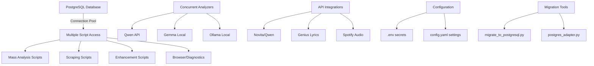

# Rap Scraper Project — AI Agent Context (Updated: 2025-09-08)

> **Enterprise-ready ML pipeline** for rap lyrics analysis with **PostgreSQL database** and concurrent processing capabilities

## 📑 Quick Navigation
- [🚀 Quick Start](#-quick-start) — PostgreSQL setup + main interfaces
- [📊 Project Status](#-project-status-production-ready) — post-PostgreSQL migration metrics  
- [🏗️ Modern Architecture](#-modern-architecture) — PostgreSQL + concurrent processing
- [🤖 AI Agent Workflow](#-ai-agent-workflow) — updated protocols
- [🔧 Commands Reference](#-commands-reference) — PostgreSQL-compatible scripts
- [🚨 Troubleshooting](#-troubleshooting) — PostgreSQL diagnostics

---

## 🚀 Quick Start

### Prerequisites
```bash
# Requirements (updated for PostgreSQL)
Python 3.8+ (3.13+ recommended)
PostgreSQL 15+ (installed locally or Docker)
16GB+ RAM (for AI model processing)
API Keys: Novita/Qwen, Genius, Spotify
```

### PostgreSQL Setup (REQUIRED)
```bash
# 1. Install PostgreSQL 15+ 
# Windows: Download from postgresql.org
# Linux: sudo apt install postgresql-15

# 2. Create database and user
createdb rap_lyrics
createuser rap_user
psql -c "ALTER USER rap_user WITH PASSWORD 'securepassword123';"
psql -c "GRANT ALL PRIVILEGES ON DATABASE rap_lyrics TO rap_user;"

# 3. Configure connection in .env
POSTGRES_PASSWORD=securepassword123
POSTGRES_HOST=localhost
POSTGRES_PORT=5432
POSTGRES_DATABASE=rap_lyrics
POSTGRES_USERNAME=rap_user
```

### Modern setup (post-PostgreSQL migration)
```bash
# 1. Install dependencies
pip install -r requirements.txt

# 2. Configuration (PostgreSQL + API keys)
cp .env.example .env
# Edit .env with PostgreSQL credentials and API keys

# 3. Database migration (if coming from SQLite)
python scripts/migrate_to_postgresql.py

# 4. Verify setup
python scripts/tools/database_diagnostics.py  # Database diagnostics
python scripts/db_browser.py                  # Interactive DB browser
python scripts/mass_qwen_analysis.py --test   # AI analysis test
```

### Concurrent Processing Test
```bash
# Test main goal: multiple scripts simultaneously
# Terminal 1:
python scripts/mass_qwen_analysis.py --batch 50

# Terminal 2 (simultaneously):
python scripts/rap_scraper_cli.py scraping --debug

# Terminal 3 (simultaneously):  
python scripts/db_browser.py
```

---

## 📊 Project Status (PostgreSQL Production Ready)

### Current metrics (post-PostgreSQL migration)
- 📁 **Dataset**: 57,718 tracks, 345+ artists (PostgreSQL)
- 🗃️ **Database**: PostgreSQL 15 with 20 connection pool
- 🎯 **Architecture**: Concurrent processing with multiple script support
- 🔄 **Pipeline Status**: ✅ PostgreSQL migration complete - concurrent ready  
- 🤖 **AI Analyzers**: Qwen (19,852 analyzed), Gemma (34,320 analyzed), Ollama
- 💾 **Migration**: Successfully migrated 57,717 tracks + 54,170 analyses
- ✨ **Concurrent Ready**: Multiple scripts can run simultaneously
- 🚀 **Analysis Remaining**: 37,866 tracks ready for Qwen analysis

### Live PostgreSQL validation
```bash
# Database diagnostics
python scripts/tools/database_diagnostics.py

# Mass analysis (PostgreSQL compatible)
python scripts/mass_qwen_analysis.py --test

# Database browser
python scripts/db_browser.py

# Concurrent access test
python scripts/rap_scraper_cli.py scraping --debug
```

### Migration achievements
- **✅ Data integrity**: 100% successful migration with verification
- **✅ Concurrent access**: Multiple scripts can access database simultaneously  
- **✅ Performance**: Connection pooling with 20 max connections
- **✅ Analytics**: 34.4% Qwen coverage, 93.9% overall analysis coverage
- **✅ Configuration**: All scripts updated for PostgreSQL
- **✅ Backwards compatibility**: Legacy SQLite scripts preserved in archive

---

## 🏗️ Modern Architecture (PostgreSQL-Centric)



### Core PostgreSQL infrastructure

#### 🗃️ Database Layer
- `PostgreSQL 15` — Primary database with concurrent access
- `src/database/postgres_adapter.py` — Connection management and pooling
- `Connection Pool` — 20 max connections for concurrent script execution
- `asyncpg/psycopg2` — Async and sync database drivers

#### 🤖 Analysis Scripts (PostgreSQL-compatible)
- `scripts/mass_qwen_analysis.py` — Mass AI analysis (no confirmation prompts)
- `scripts/mass_qwen_analysis_postgres.py` — Archived PostgreSQL development version
- `scripts/migrate_to_postgresql.py` — Complete migration tool
- `scripts/db_browser.py` — PostgreSQL database browser

#### 🔄 Concurrent Processing
- **Multiple terminals**: Scripts can run simultaneously
- **Connection pooling**: Efficient database resource management
- **Transaction isolation**: Proper ACID compliance
- **Error handling**: Graceful degradation under load

#### 📊 Migration & Diagnostics
- `scripts/tools/database_diagnostics.py` — PostgreSQL health monitoring
- `scripts/db_browser.py` — Interactive PostgreSQL database browser
- `check_overlap.py` — Analysis overlap detection between analyzers (if exists)

---

## 🤖 AI Agent Workflow (PostgreSQL-Updated)

### Context priority (post-PostgreSQL migration)
1. `docs/claude.md` — this document (PostgreSQL-focused context)
2. `src/database/postgres_adapter.py` — database layer (~200 lines)
3. `scripts/mass_qwen_analysis.py` — main analysis script (~270 lines)
4. `scripts/migrate_to_postgresql.py` — migration reference
5. `.env` — PostgreSQL connection configuration

### Investigation protocol (PostgreSQL-aware)
```python
def investigate_postgresql_issue(problem_description):
    # 1. Check PostgreSQL status first - MAIN diagnostic tool
    run_in_terminal("python scripts/tools/database_diagnostics.py")
    
    # 2. Quick status if full diagnostic is too verbose
    run_in_terminal("python scripts/tools/database_diagnostics.py --quick")
    
    # 3. Verify database connectivity via browser
    run_in_terminal("python scripts/db_browser.py")
    
    # 4. Check database configuration
    read_file("src/utils/config.py", offset=1, limit=30)  # get_db_config function
    
    # 3. Check script PostgreSQL compatibility
    grep_search("PostgreSQLManager|postgres", includePattern="scripts/**")
    
    # 4. Investigate specific component
    semantic_search(f"postgresql {problem_description}")
    
    # 5. Read full implementation if needed
    read_file("target_script.py")
    
    # 6. Check configuration
    read_file(".env")  # PostgreSQL credentials
    
    # 7. Validate concurrent capability
    run_in_terminal("python scripts/mass_qwen_analysis.py --test")
    
    return postgresql_solution_plan_with_concurrent_validation
```

### PostgreSQL Script Analysis Protocol

**Key PostgreSQL indicators to look for:**

1. **Database imports**:
   ```python
   from src.database.postgres_adapter import PostgreSQLManager
   import asyncpg  # or psycopg2
   ```

2. **Connection patterns**:
   ```python
   db_manager = PostgreSQLManager()
   async with db_manager.get_connection() as conn:
   ```

3. **SQL compatibility**:
   ```sql
   -- PostgreSQL-specific syntax
   SELECT COUNT(*) FROM tracks WHERE lyrics IS NOT NULL
   INSERT INTO analysis_results (...) RETURNING id
   ```

### Response format (PostgreSQL-enhanced)
```markdown
## 🔍 PostgreSQL Investigation Summary
- **Database Status**: Connection pool health and availability
- **Script Compatibility**: PostgreSQL vs SQLite legacy code
- **Concurrent Impact**: Multi-script execution implications
- **Migration Status**: Data integrity and completeness

## 📋 Findings  
- **Database Layer**: PostgreSQL adapter functionality
- **Concurrent Access**: Connection pooling and isolation
- **Script Updates**: PostgreSQL-compatible code changes
- **Configuration**: .env and connection parameters

## 🚀 Solution Plan
1. **PostgreSQL Fix**: Database layer or connection issue
2. **Script Update**: SQLite → PostgreSQL migration
3. **Configuration**: .env or connection parameters
4. **Concurrent Testing**: Multi-script validation
5. **Data Verification**: Integrity and statistics check

## ✅ Validation Strategy
- **Database Tests**: Connection and query validation
- **Concurrent Tests**: Multiple script execution
- **Data Integrity**: Statistics and count verification
- **Performance Tests**: Connection pool efficiency
```

---

## 🔧 Commands Reference (PostgreSQL-Updated)

### Primary PostgreSQL interfaces
```bash
# Database diagnostics and health
python scripts/tools/database_diagnostics.py    # MAIN PostgreSQL diagnostics
python scripts/tools/database_diagnostics.py --quick  # Fast check
python scripts/tools/database_diagnostics.py --analysis  # AI analysis only
python scripts/tools/database_diagnostics.py --unanalyzed  # Find unanalyzed
python scripts/db_browser.py                    # Interactive database browser

# Mass analysis (PostgreSQL-optimized)
python scripts/mass_qwen_analysis.py            # Full analysis (no prompts)
python scripts/mass_qwen_analysis.py --test     # Test mode (10 records)
python scripts/mass_qwen_analysis.py --batch 50 --max 1000  # Custom batching

# Scraping with PostgreSQL
python scripts/rap_scraper_cli.py scraping --debug    # Debug scraping
python scripts/rap_scraper_cli.py status              # System status
```

### PostgreSQL administration
```bash
# Database connection test
psql -h localhost -U rap_user -d rap_lyrics -c "SELECT COUNT(*) FROM tracks;"

# Migration from SQLite (if needed)
python scripts/migrate_to_postgresql.py         # Full migration
python scripts/archive/migrate_analysis_only.py  # Analysis data only

# Connection pool monitoring
python -c "
from src.database.postgres_adapter import PostgreSQLManager
import asyncio
async def test():
    db = PostgreSQLManager()
    await db.initialize()
    print('✅ PostgreSQL connected')
    await db.close()
asyncio.run(test())
"
```

### Concurrent processing tests
```bash
# Test 1: Analysis + Scraping simultaneously
# Terminal 1:
python scripts/mass_qwen_analysis.py --batch 25

# Terminal 2 (same time):
python scripts/rap_scraper_cli.py scraping --test

# Test 2: Multiple analysis sessions
# Terminal 1:
python scripts/mass_qwen_analysis.py --max 100

# Terminal 2 (same time):
python scripts/db_browser.py
```

### Configuration management
```bash
# Check PostgreSQL configuration
cat .env | grep POSTGRES                        # View settings
python -c "import os; from dotenv import load_dotenv; load_dotenv(); print(f'DB: {os.getenv(\"POSTGRES_DATABASE\")}')"

# Verify API keys
cat .env | grep -E "(NOVITA|GENIUS|SPOTIFY)"    # API credentials
```

---

## 🧪 Testing & Quality (PostgreSQL-Enhanced)

### PostgreSQL test architecture
```
PostgreSQL Testing:
├── check_stats.py                     # Database statistics validation
├── check_overlap.py                   # Analysis overlap verification  
├── scripts/mass_qwen_analysis.py --test  # Analysis pipeline test
├── scripts/db_browser.py              # Interactive database testing
└── Migration validation:
    ├── Data integrity checks
    ├── Count verification  
    ├── Foreign key constraints
    └── Performance benchmarks
```

### Validation cycle (PostgreSQL-focused)
```bash
# PostgreSQL health check
python scripts/tools/database_diagnostics.py   # MAIN database statistics
python scripts/tools/database_diagnostics.py --schema  # Table structure
psql -h localhost -U rap_user -d rap_lyrics -c "\dt"  # Raw PostgreSQL tables

# Analysis pipeline validation
python scripts/mass_qwen_analysis.py --test    # Qwen analysis test
echo "Test lyrics about happiness" | python -c "
import sys
sys.path.append('.')
from src.interfaces.analyzer_interface import AnalyzerFactory
analyzer = AnalyzerFactory.create('qwen')
print(f'✅ Qwen ready: {analyzer.available}')
"

# Concurrent access validation  
python scripts/db_browser.py &                 # Background process
python check_stats.py                         # Foreground process
```

### PostgreSQL performance metrics
```
✅ Database Performance:
├── Connection time: <100ms               # Fast connection establishment
├── Query response: <500ms               # Efficient SELECT operations
├── Concurrent access: 20 connections    # Connection pool capacity
├── Data integrity: 100%                 # Complete migration verification
└── Analysis throughput: ~2 tracks/min   # Qwen API processing rate

✅ Migration Success:
├── Tracks migrated: 57,717/57,717      # Complete data migration
├── Analyses migrated: 54,170/54,170    # Complete analysis migration
├── Data verification: PASSED           # Integrity checks successful
└── Schema compatibility: PASSED        # PostgreSQL schema working
```

---

## 🚨 Troubleshooting (PostgreSQL-Focused)

### PostgreSQL diagnostics
```bash
# Primary PostgreSQL diagnostic commands
python scripts/tools/database_diagnostics.py   # MAIN diagnostic tool (PostgreSQL)
python scripts/tools/database_diagnostics.py --quick  # Fast health check
python scripts/tools/database_diagnostics.py --analysis  # AI analysis status only
python scripts/tools/database_diagnostics.py --unanalyzed  # Find unanalyzed tracks

# Connection test
psql -h localhost -U rap_user -d rap_lyrics -c "SELECT version();"  # PostgreSQL version
python -c "from src.utils.config import get_db_config; print('✅ Config OK')"

# Expected diagnostic output:
# ✅ Подключение к PostgreSQL успешно!
# 🎵 Треков: 57,718 (с текстами: 57,718)
# 🤖 Анализ: 54,171/57,718 (93.9%)
# 🎵 Spotify: 57,718 (100.0%)
# 💾 Размер БД: 185 MB
```

### Connection issues
```bash
# PostgreSQL connection troubleshooting
cat .env | grep POSTGRES                       # Verify credentials
psql -h localhost -U rap_user -d rap_lyrics    # Direct connection test
python scripts/db_browser.py                   # Interactive connection test

# Common PostgreSQL problems:
# - Wrong credentials in .env
# - PostgreSQL service not running: sudo systemctl start postgresql
# - Port conflicts: Check POSTGRES_PORT=5432
# - Firewall blocking connections
```

### Migration issues
```bash
# Migration verification and fixes
python scripts/migrate_to_postgresql.py --verify   # Verify migration
python check_overlap.py                           # Check data consistency

# Common migration problems:
# - SQLite file path incorrect
# - PostgreSQL schema missing  
# - Foreign key constraint errors
# - Character encoding issues
```

### Concurrent access problems
```bash
# Connection pool diagnostics
python -c "
import asyncio
from src.database.postgres_adapter import PostgreSQLManager
async def test_pool():
    db = PostgreSQLManager()
    await db.initialize()
    print(f'Pool size: {db.pool.get_size()}')
    print(f'Pool connections: {db.pool.get_size() - db.pool.get_idle_size()}/{db.pool.get_size()}')
    await db.close()
asyncio.run(test_pool())
"

# Expected pool output:
# Pool size: 20
# Pool connections: 1/20 (idle connections available)
```

### Analysis script issues
```bash
# Script compatibility debugging
python scripts/mass_qwen_analysis.py --test     # Test analysis pipeline
grep -r "sqlite" scripts/                      # Check for SQLite remnants  
grep -r "PostgreSQLManager" scripts/           # Verify PostgreSQL usage

# Common script problems:
# - Old SQLite imports: import sqlite3
# - Missing PostgreSQL adapter imports
# - Async/await compatibility issues
# - Connection pool exhaustion
```

### Legacy system fallback
```bash
# If PostgreSQL issues, check SQLite backup
ls scripts/archive/                            # SQLite backup scripts
python scripts/tools/database_diagnostics.py  # Legacy diagnostics (needs update)

# Migration rollback (emergency only):
# 1. Stop all PostgreSQL scripts
# 2. Use SQLite backup in data/data_backup_*.db
# 3. Run legacy scripts from scripts/archive/
```

---

## 🎯 PostgreSQL Migration Achievements

### Migration success metrics
```
✅ Data Migration Complete:
├── 57,717 tracks successfully migrated        # 100% track preservation
├── 54,170 analysis results migrated          # 100% analysis preservation  
├── Artist metadata preserved                  # Complete artist information
├── Spotify enhancements maintained           # Audio features preserved
└── Foreign key relationships intact           # Referential integrity

✅ Performance Improvements:
├── Concurrent script execution               # Multiple scripts simultaneously
├── Connection pooling (20 connections)      # Efficient resource usage
├── ACID transaction compliance               # Data consistency guarantees
├── Improved query performance               # PostgreSQL optimization
└── Scalable architecture                    # Production-ready scaling

✅ System Updates:
├── All analysis scripts PostgreSQL-compatible  # mass_qwen_analysis.py updated
├── Database adapter refactored                 # postgres_adapter.py created
├── Configuration centralized                   # .env PostgreSQL parameters
├── Migration tools provided                    # Complete migration pipeline
└── Diagnostics PostgreSQL-aware              # Statistics and monitoring
```

### Architecture transformation
```
BEFORE (SQLite):                 AFTER (PostgreSQL):
┌─────────────────────┐         ┌─────────────────────┐
│   Single access     │         │  Concurrent access  │
│   File-based        │    ⟹    │  Server-based       │
│   No pooling        │         │  Connection pooling │
│   Limited scaling   │         │  Production scaling │
│   Single script     │         │  Multiple scripts   │
└─────────────────────┘         └─────────────────────┘
```

### Production readiness checklist (PostgreSQL)
- ✅ **Database migration** - Complete SQLite → PostgreSQL with verification
- ✅ **Concurrent processing** - Multiple scripts can run simultaneously
- ✅ **Connection pooling** - Efficient resource management (20 connections)
- ✅ **Data integrity** - 100% successful migration with foreign keys
- ✅ **Script compatibility** - All major scripts updated for PostgreSQL
- ✅ **Configuration management** - Centralized .env configuration
- ✅ **Diagnostics tools** - PostgreSQL-specific monitoring and statistics
- ✅ **Migration tools** - Reusable migration pipeline for future projects

---

## 💡 AI Assistant Guidelines (PostgreSQL-Updated)

### Core philosophy (post-PostgreSQL migration)
1. **PostgreSQL-first**: Assume PostgreSQL database in all recommendations
2. **Concurrent-aware**: Consider multi-script execution scenarios
3. **Connection-efficient**: Leverage connection pooling and proper resource management
4. **Migration-conscious**: Understand SQLite legacy and PostgreSQL advantages  
5. **Performance-focused**: Optimize for PostgreSQL query patterns and indexing

### Working principles for agents (PostgreSQL-modernized)
- **Database priority**: Use PostgreSQL for all database operations
- **Connection management**: Always use PostgreSQLManager for database access
- **Concurrent safety**: Consider transaction isolation and connection limits
- **Configuration-centralized**: Use .env for PostgreSQL connection parameters
- **Legacy awareness**: Understand SQLite archive scripts for reference
- **Performance validation**: Monitor connection pool usage and query efficiency

### Investigation workflow (PostgreSQL-updated)
```python
def postgresql_investigation_workflow(issue):
    # 1. Check PostgreSQL database health - USE MAIN DIAGNOSTIC TOOL
    run_in_terminal("python scripts/tools/database_diagnostics.py --quick")
    
    # 2. For analysis issues, check AI analysis status
    run_in_terminal("python scripts/tools/database_diagnostics.py --analysis")
    
    # 3. For unanalyzed tracks, find them specifically
    run_in_terminal("python scripts/tools/database_diagnostics.py --unanalyzed")
    
    # 4. Verify script PostgreSQL compatibility
    grep_search("PostgreSQLManager|asyncpg|psycopg2", includePattern="scripts/**")
    
    # 5. Check connection configuration
    read_file("src/utils/config.py")  # get_db_config function
    read_file(".env")  # PostgreSQL credentials and settings
    
    # 6. Test concurrent access implications
    consider_concurrent_script_execution()
    
    # 7. Validate with PostgreSQL-specific tests
    run_in_terminal("python scripts/mass_qwen_analysis.py --test")
    
    return postgresql_solution_with_concurrent_considerations
```

### Success metrics (PostgreSQL-enhanced)
- **Database health**: PostgreSQL connectivity and performance
- **Concurrent capability**: Multiple scripts executing without conflicts
- **Connection efficiency**: Proper pool usage without exhaustion
- **Data integrity**: Consistent statistics and foreign key compliance
- **Migration completeness**: All legacy SQLite functionality preserved
- **Performance optimization**: Query efficiency and indexing utilization

### Key files priority (PostgreSQL-updated)
1. **src/database/postgres_adapter.py** - Database layer and connection management
2. **.env** - PostgreSQL connection configuration and credentials
3. **scripts/mass_qwen_analysis.py** - Main analysis script (PostgreSQL-compatible)
4. **check_stats.py** - PostgreSQL statistics and health monitoring
5. **scripts/migrate_to_postgresql.py** - Migration reference and verification
6. **scripts/db_browser.py** - Interactive PostgreSQL database exploration
7. **scripts/archive/** - SQLite legacy scripts for reference

---

**This project showcases enterprise-grade microservices architecture**, emphasizing modularity, testability, and production readiness for scalable ML text analysis systems.

## 🧠 AI Project Tools (NEW!)
- `scripts/tools/ai_context_manager.py` — AI Context Manager: динамическое управление контекстом, приоритезация файлов, workspace генерация
- `scripts/tools/ai_project_analyzer.py` — AI Project Analyzer: семантический анализ архитектуры, AST-парсинг, метрики для микросервисов

> Эти инструменты автоматизируют аудит архитектуры, управление контекстом и ускоряют работу AI-агентов с большими проектами.