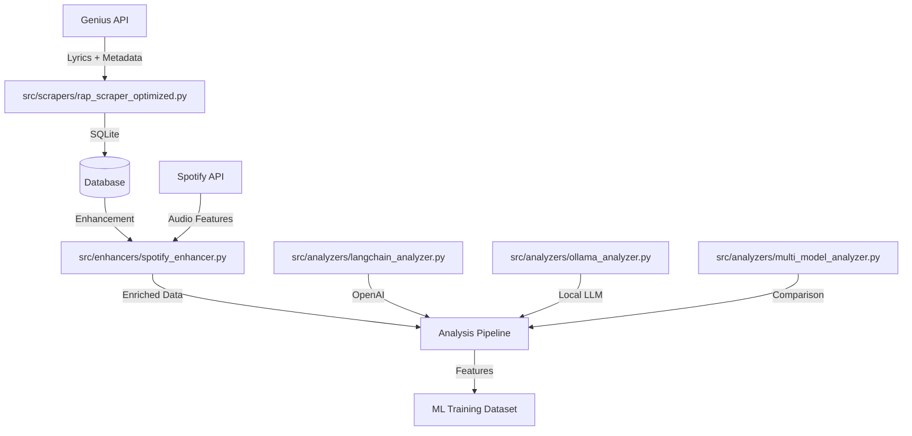

# Rap Scraper Project — AI Agent Context

> **ML pipeline for conditional rap lyrics generation**, using structured metadata from the Genius API and the Spotify Web API.

## 📑 Quick navigation
- [🚀 Quick Start](#-quick-start) — get running in 5 minutes
- [📊 Project Status](#-project-status-live-dashboard) — current metrics
- [🏗️ Architecture](#-architecture) — system overview
- [🤖 AI Agent Workflow](#-ai-agent-workflow) — how to work with the project
- [🔧 Commands Reference](#-commands-reference) — main commands
- [🚨 Troubleshooting](#-troubleshooting) — common fixes

---

## 🚀 Quick Start

### Prerequisites
```bash
# Requirements
Python 3.13+
SQLite 3.x
API keys: Genius (required), Spotify (optional for enrichment)
```

### 2-minute setup
```bash
# 1. Install dependencies
pip install -r requirements.txt

# 2. Configuration
# Copy the template and fill your API keys
# PowerShell example:
# Copy-Item .env.example .env; notepad .env

# 3. Check status via CLI
python scripts/rap_scraper_cli.py status
```

### First run (recommended via unified CLI)
```bash
# End-to-end smoke test (small sample)
python scripts/rap_scraper_cli.py scraping --limit 10
python scripts/rap_scraper_cli.py spotify --limit 10 --continue
python scripts/rap_scraper_cli.py analysis --analyzer multi --limit 5

# Database stats
python scripts/rap_scraper_cli.py monitoring --component database
```

---

## 📊 Project Status (Live Dashboard)

### Current metrics
- 📁 **Dataset**: ~48K tracks, ~263 artists (full dataset)
- 🎯 **Spotify Coverage**: ~99.6% artists enriched
- 🔄 **Pipeline Status**: ongoing track enrichment
- 🎵 **Audio Features**: graceful degradation (403/permission issues handled)
- 🚀 **ML Readiness**: feature engineering in progress

### Active components (quick checks)
```bash
# Check status via CLI
python scripts/rap_scraper_cli.py status

# Key state files & directories
- data/rap_lyrics.db (main SQLite DB)
- analysis_results/ (ML outputs)
- enhanced_data/ (enriched JSONL)
```

---

## 🏗️ Architecture


```mermaid
graph TD
    A[Genius API] -->|Lyrics + Metadata| B[src/scrapers/rap_scraper_optimized.py]
    B -->|SQLite| C[(Database)]
    C -->|Enhancement| D[src/enhancers/spotify_enhancer.py]
    E[Spotify API] -->|Audio Features| D
    D -->|Enriched Data| F[Analysis Pipeline]
    F -->|Features| G[ML Training Dataset]

    H[src/analyzers/langchain_analyzer.py] -->|OpenAI| F
    I[src/analyzers/ollama_analyzer.py] -->|Local LLM| F
    J[src/analyzers/multi_model_analyzer.py] -->|Comparison| F
```

### Core components

#### Data collection layer
- `src/scrapers/rap_scraper_optimized.py` — optimized Genius scraper with batching (legacy wrappers available under `scripts/legacy/`)
- `src/enhancers/spotify_enhancer.py` — Spotify metadata enrichment
- `src/enhancers/bulk_spotify_enhancement.py` — bulk enhancement utilities

#### Data models & storage
- `src/models/models.py` — Pydantic models (SpotifyArtist, SpotifyTrack, etc.)
- `data/rap_lyrics.db` — SQLite DB with primary tables

Example schema (informational):
```sql
songs: id, title, artist, lyrics, url, genre, year
spotify_artists: name, spotify_id, genres, popularity, followers
spotify_audio_features: track_id, danceability, energy, valence, tempo
```

#### ML analysis layer
- `src/analyzers/langchain_analyzer.py` — analysis via LangChain + OpenAI
- `src/analyzers/ollama_analyzer.py` — local analysis via Ollama
- `src/analyzers/multi_model_analyzer.py` — model comparison
- `src/analyzers/optimized_analyzer.py` — production-ready analysis pipeline

---

## 🤖 AI Agent Workflow

### Context priority (read in this order)
1. `docs/claude.md` — this document (project context)
2. `docs/PROJECT_DIARY.md` — full development history and cases
3. `src/models/models.py` — data structures and API contracts
4. The working file related to the current task

### Investigation protocol (standard)
```python
def investigate_issue(problem_description):
    # 1. Understand scope: semantic_search on the error
    semantic_search(f"error {problem_description}")

    # 2. Find relevant code
    grep_search(f"def.*{main_component}")
    list_code_usages("ProblemClass")

    # 3. Deep dive
    read_file("problematic_module.py")

    # 4. Pattern search
    grep_search("similar_error_pattern")

    # 5. Return a detailed plan
    return detailed_plan_with_validation_steps
```

### Response format (required)
When reporting investigation results, follow this structure:

```markdown
## 🔍 Investigation Summary
- **Current Understanding**: short summary
- **Knowledge Gaps**: what needs more research

## 📋 Findings
- **Root Cause**: technical cause
- **Impact**: affected components
- **Code Locations**: files/lines

## 🚀 Solution Plan
1. **Step 1**: action + expected outcome
2. **Step 2**: action + validation
3. **Step N**: ...

## ✅ Validation Needed
- **User Approval**: yes/no
- **Testing**: tests or checks to run
```

---

## 🔧 Development phases

### Phase 1: Research & understanding
```bash
semantic_search("main pipeline functionality")
grep_search("def main|if __name__")
file_search("**/test_*.py")
get_changed_files()
```

### Phase 2: Planning
- Draft a step-by-step plan with risks and rollback criteria
- Identify dependencies and side effects
- Define success criteria and validation steps

### Phase 3: Validation
- Discuss plan with the user
- Adjust based on feedback
- Approve before execution

### Phase 4: Execution
- Execute in small, tested steps
- Run tests after each change
- Handle errors gracefully

### Phase 5: Documentation
- Update `PROJECT_DIARY` with STAR-format notes
- Add code comments for complex logic
- Update README/docs if behavior or CLI changes

---

## 🔧 Commands reference

### Canonical pipeline (use the CLI)
```bash
# Scraping (collect lyrics and metadata)
python scripts/rap_scraper_cli.py scraping

# Spotify enrichment (start/continue)
python scripts/rap_scraper_cli.py spotify --continue

# Run ML analysis
python scripts/rap_scraper_cli.py analysis --analyzer langchain
python scripts/rap_scraper_cli.py analysis --analyzer ollama
python scripts/rap_scraper_cli.py analysis --analyzer multi

# Monitoring & status
python scripts/rap_scraper_cli.py monitoring --component all
python scripts/rap_scraper_cli.py monitoring --component database
python scripts/rap_scraper_cli.py status
```

### Direct / advanced invocations (legacy and debugging)
```bash
# Direct module runs (advanced users)
python src/scrapers/rap_scraper_optimized.py --limit 10
python src/enhancers/bulk_spotify_enhancement.py
python src/enhancers/spotify_enhancer.py --artist "Drake"

# Utilities (preferred via src/utils)
python src/utils/check_db.py --stats
python src/utils/setup_spotify.py --refresh
python src/utils/migrate_database.py --repair
```

### Run modes
```bash
# Development (safe)
python scripts/rap_scraper_cli.py scraping --limit 10 --dry-run

# Production
python scripts/rap_scraper_cli.py scraping --batch-size 100

# Debug (verbose logs)
python scripts/rap_scraper_cli.py spotify --verbose --log-level DEBUG
```

---

## 🎨 Code style & architecture guidelines

### Python standards
- Python 3.13+ with type hints
- Pydantic models for API validation
- SQLite usage with context managers
- Rate limiting for all external API calls
- Structured logging with correlation IDs where useful

### Architectural principles
- Separation of concerns: scraping → enhancement → analysis
- Incremental processing and resume capability
- Graceful degradation for partial failures
- Batch processing for performance

### Anti-patterns to avoid
- Hardcoded credentials (use `.env`)
- Blocking API calls without timeout
- Unhandled exceptions in production
- Magic numbers without constants

---

## 🧪 Testing & quality

### Recommended cycle
```bash
# Full development cycle
pytest tests/ --verbose
python -m mypy src/
python -m flake8 src/
```

### Quick module check
```bash
pytest tests/test_spotify_enhancer.py -v
```

### Test structure (expected)
```
tests/
├── test_spotify_enhancer.py
├── test_models.py
├── test_database.py
├── test_scraper.py
└── conftest.py
```

---

## 🚨 Troubleshooting

### Common API issues
- Genius API: 403 Forbidden → check `GENIUS_TOKEN` in `.env` and rate limits (1 req/sec)
- Spotify API: 403 on audio features → fallback mode disables audio features
- Token expired → run `python src/utils/setup_spotify.py --refresh`

### Database problems
```bash
# Corrupted DB
python src/utils/migrate_database.py --repair

# Missing tables (auto-fix)
python src/utils/check_db.py --create-missing
```

### Performance issues
- Slow scraping: increase batch_size or enable streaming
- Memory issues: lower batch sizes or use streaming mode
- API rate limits: automatic backoff is implemented — check logs

### Development issues
```bash
# Dependency/import errors
pip install -r requirements.txt --upgrade

# Type checking errors
python -m mypy --install-types

# Test failures
pytest tests/ --tb=short
```

---

## 🎯 ML pipeline goals

### Project goal
**Conditional Rap Lyrics Generation** — artist style + genre + mood → authentic generated lyrics

### Training pipeline
1. Data collection: 48K+ tracks with rich metadata
2. Feature engineering: sentiment, complexity, audio features
3. Model training: fine-tuning on structured dataset
4. Generation: controlled sampling for style/mood

### Available features for training
- Lyrics text (full corpus)
- Artist metadata
- Spotify audio features (energy, valence, danceability)
- Genre labels
- Sentiment and complexity metrics

---

## 📁 Key files reference

### Config & models
- `src/models/models.py` — Pydantic schemas
- `requirements.txt` — Python dependencies
- `.env` — API credentials (DO NOT commit; create from `.env.example`)

### Documentation & history
- `docs/PROJECT_DIARY.md` — detailed project case history
- `docs/TECH_SUMMARY.md` — technical summary
- `docs/PROJECT_EVOLUTION.md` — architecture change log

### Data & results
- `data/rap_lyrics.db` — primary SQLite DB
- `analysis_results/` — CSV/JSON outputs from analysis
- `enhanced_data/` — enriched JSONL exports

---

## 📈 Project evolution (case status)

### Completed
- 48K+ tracks collected from Genius API
- ~99.6% Spotify enrichment coverage
- Full type safety via Pydantic models
- Production-ready features: retries, backoff, graceful degradation
- Comprehensive documentation in `docs/`

### In progress
- Track enrichment via Spotify (bulk processing)
- Audio features recovery for blocked endpoints
- Feature engineering for ML training

### Next milestones
- Complete Spotify audio features coverage
- Automated sentiment/mood pipeline
- Prepare final ML training dataset and splits
- Architect model for conditional generation

---

## 💡 AI assistant guidelines

### Core philosophy
1. ML-first: every change should improve training data quality
2. Data quality over quantity
3. Respect external APIs: apply rate limits and retries
4. Incremental progress with measurable value
5. Production readiness and observability

### Working principles for agents
- Agentic exploration (inspect code & run checks) over blind RAG
- Plan first, validate, execute in small steps
- Document changes in `docs/PROJECT_DIARY.md`
- Test-driven approach for changes
- Keep ML goals in focus for all changes

### Success metrics
- Code quality: types, tests, documentation
- Pipeline reliability: resume capability, error handling
- ML readiness: feature completeness and consistency
- Developer UX: clear CLI and debugging tools

---

**This project is a showcase of modern ML engineering practices**, emphasizing data quality, API integration, and production readiness for conditional text generation.