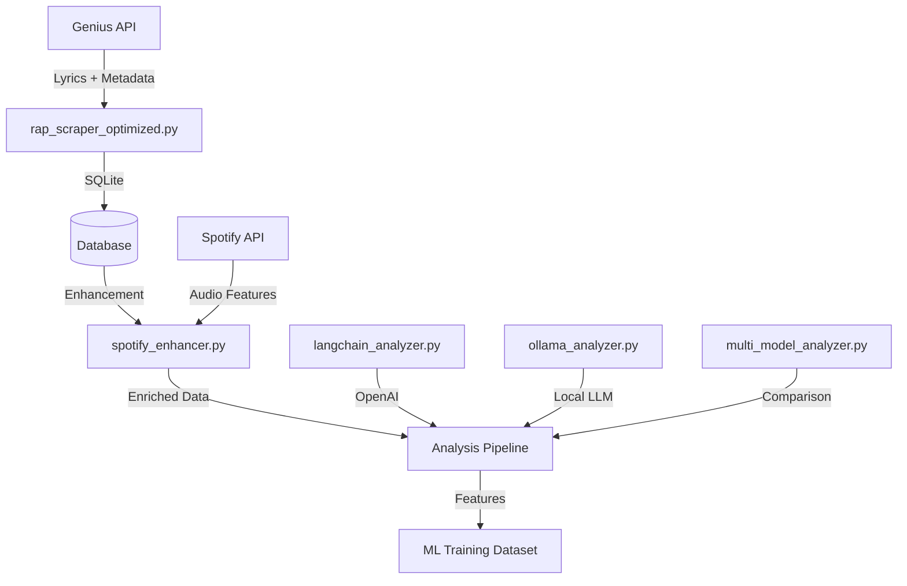

# Rap Scraper Project - AI Agent Context

> **ML пайплайн для условной генерации рэп-лирики** с использованием структурированных метаданных из Genius API и Spotify Web API.

## 📑 Быстрая навигация
- [🚀 Quick Start](#-quick-start) - запуск за 5 минут
- [📊 Project Status](#-project-status-live-dashboard) - текущие метрики
- [🏗️ Architecture](#️-архитектура-проекта) - понимание системы
- [🤖 AI Agent Workflow](#-ai-agent-workflow) - как работать с проектом
- [🔧 Commands Reference](#-commands-reference) - основные команды
- [🚨 Troubleshooting](#-troubleshooting) - решение проблем

---

## 🚀 Quick Start

### Prerequisites
```bash
# Требования
Python 3.13+
SQLite 3.x
API keys: Genius, Spotify (optional)
```

### Установка за 2 минуты
```bash
# 1. Зависимости
pip install -r requirements.txt

# 2. Конфигурация  
cp .env.example .env  # добавь свои API keys

# 3. Проверка состояния
python check_db.py
```

### Первый запуск
```bash
# Базовый пайплайн (10 треков для теста)
python rap_scraper_optimized.py --limit 10

# Проверить результаты
python check_db.py --stats

# Анализ данных  
python multi_model_analyzer.py --sample 5
```

---

## 📊 Project Status (Live Dashboard)

### Текущие метрики
- 📁 **Dataset**: 47,971 tracks, 259 artists (полная база)
- 🎯 **Spotify Coverage**: 99.6% artists enriched (258/259)
- 🔄 **Pipeline Status**: Track enrichment в процессе
- 🎵 **Audio Features**: Graceful degradation (403 errors handled)
- 🚀 **ML Readiness**: Feature engineering phase

### Активные компоненты
```python
# Проверить статус
python project_status.py  # TODO: создать этот скрипт

# Основные файлы состояния
- rap_lyrics.db (47K треков)
- analysis_results/ (ML выходы)
- enhanced_data/ (обогащенные JSONL)
```

---

## 🏗️ Архитектура проекта


```mermaid
graph TD
    A[Genius API] -->|Lyrics + Metadata| B[rap_scraper_optimized.py]
    B -->|SQLite| C[(Database)]
    C -->|Enhancement| D[spotify_enhancer.py]
    E[Spotify API] -->|Audio Features| D
    D -->|Enriched Data| F[Analysis Pipeline]
    F -->|Features| G[ML Training Dataset]
    
    H[langchain_analyzer.py] -->|OpenAI| F
    I[ollama_analyzer.py] -->|Local LLM| F
    J[multi_model_analyzer.py] -->|Comparison| F
```

### Основные компоненты

#### Data Collection Layer
- **`rap_scraper_optimized.py`** - оптимизированный Genius API scraper с батчингом
- **`spotify_enhancer.py`** - обогащение метаданными через Spotify Web API
- **`bulk_spotify_enhancement.py`** - массовая обработка треков

#### Data Models & Storage  
- **`models.py`** - Pydantic модели для типизации (SpotifyArtist, SpotifyTrack, etc.)
- **`rap_lyrics.db`** - SQLite база с тремя основными таблицами:
  ```sql
  songs: id, title, artist, lyrics, url, genre, year
  spotify_artists: name, spotify_id, genres, popularity, followers  
  spotify_audio_features: track_id, danceability, energy, valence, tempo
  ```

#### ML Analysis Layer
- **`langchain_analyzer.py`** - анализ через LangChain + OpenAI API
- **`ollama_analyzer.py`** - локальный анализ через Ollama
- **`multi_model_analyzer.py`** - сравнение разных LLM моделей
- **`optimized_analyzer.py`** - production-ready пайплайн

---

## 🤖 AI Agent Workflow

### Context Priority (читать в порядке важности)
1. **`@claude.md`** (этот файл) - общий контекст проекта
2. **`@PROJECT_DIARY.md`** - полная история 12+ кейсов развития  
3. **`@models.py`** - структуры данных и API контракты
4. **Current working file** - файл, связанный с конкретной задачей

### Investigation Protocol
```python
# Стандартный workflow исследования для AI агента
def investigate_issue(problem_description):
    """
    Agentic exploration вместо RAG - исследуй код как human developer
    """
    # 1. Понять scope проблемы
    semantic_search(f"error {problem_description}")
    
    # 2. Найти relevant code  
    grep_search(f"def.*{main_component}")
    list_code_usages("ProblemClass")
    
    # 3. Deep dive изучение
    read_file("problematic_module.py")  # с полным контекстом
    
    # 4. Найти patterns
    grep_search("similar_error_pattern")
    
    # 5. Plan solution
    return detailed_plan_with_validation_steps
```

### Response Format (обязательно следовать)
```markdown
## 🔍 Investigation Summary
- **Current Understanding**: Что я понял из проблемы
- **Knowledge Gaps**: Что нужно дополнительно исследовать

## 📋 Findings  
- **Root Cause**: Техническая причина проблемы
- **Impact**: Что это ломает/влияет
- **Code Locations**: Конкретные файлы и строки

## 🚀 Solution Plan
1. **Step 1**: Конкретное действие с expected outcome
2. **Step 2**: Следующий шаг с validation method
3. **Step N**: ...

## ✅ Validation Needed
- **User Approval**: План требует подтверждения? 
- **Testing**: Какие тесты запустить после изменений?
```

### Development Phases

#### 🔍 Phase 1: Research & Understanding
```bash
# Начальное понимание
semantic_search("main pipeline functionality")
grep_search("def main|if __name__")  # найти entry points

# Углубленное изучение
list_code_usages("ClassName")  # как используется класс
file_search("**/test_*.py")    # найти существующие тесты  
get_changed_files()            # последние изменения
```

#### 📋 Phase 2: Planning  
- Детальный план с шагами и рисками
- Identification dependencies и side effects
- Clear success criteria и rollback plan

#### ✅ Phase 3: Validation
- Обсуждение плана с пользователем
- Корректировка на основе feedback
- Final approval перед execution

#### 🚀 Phase 4: Execution  
- Пошаговое выполнение утвержденного плана
- Continuous testing после каждого изменения
- Graceful handling unexpected issues

#### 📝 Phase 5: Documentation
- Обновление PROJECT_DIARY с STAR format
- Code comments для complex logic
- Update README/docs если нужно

---

## 🔧 Commands Reference

### Основной пайплайн
```bash
# Data Collection
python rap_scraper_optimized.py              # Новые треки с Genius
python bulk_spotify_enhancement.py           # Массовое обогащение метаданными  
python spotify_enhancer.py --artist "Drake"  # Конкретный артист

# ML Analysis
python langchain_analyzer.py     # OpenAI анализ (требует API key)
python ollama_analyzer.py       # Локальный анализ (Llama/Mistral)
python multi_model_analyzer.py  # Сравнение разных моделей
python optimized_analyzer.py    # Production пайплайн

# Утилиты и проверки
python check_db.py                    # Состояние базы данных
python check_db.py --stats           # Детальная статистика  
python setup_spotify.py              # Настройка Spotify OAuth
python migrate_database.py           # Миграции схемы DB
python project_status.py             # Live dashboard (TODO)
```

### Режимы запуска
```bash
# Development mode (безопасно для тестирования)
python rap_scraper_optimized.py --limit 10 --dry-run

# Production mode (полная обработка)  
python rap_scraper_optimized.py --batch-size 100

# Debug mode (подробные логи)
python spotify_enhancer.py --verbose --log-level DEBUG
```

---

## 🎨 Code Style & Architecture

### Python Standards
```python
# Обязательные практики
- Python 3.13+ с type hints везде
- Pydantic модели для API валидации  
- SQLite с context managers (безопасность)
- Rate limiting для ALL API calls (respectful scraping)
- Structured logging с correlation IDs
```

### Архитектурные принципы
- **Separation of Concerns**: scraping → enhancement → analysis
- **Incremental Processing**: resume functionality обязательно  
- **Graceful Degradation**: система работает при partial failures
- **Batch Processing**: оптимизация для производительности

### Что избегать ❌
```python
# Плохие практики
- Inline комментарии с obvious content
- Hardcoded credentials (используем .env)
- Blocking API calls без timeouts  
- Unhandled exceptions в production
- Magic numbers без констант
```

---

## 🧪 Testing & Quality

### Test-Driven Development Cycle
```bash
# Полный цикл разработки
1. pytest tests/ --verbose              # Запуск всех тестов
2. python -m mypy *.py                  # Type checking
3. python -m flake8 *.py               # Code linting  
4. git add . && git commit -m "description"  # Коммит изменений

# Быстрая проверка конкретного модуля
pytest tests/test_spotify_enhancer.py -v
```

### Test Structure
```
tests/
├── test_spotify_enhancer.py    # Unit тесты API integration
├── test_models.py              # Pydantic models validation
├── test_database.py            # SQLite operations  
├── test_scraper.py             # Genius API тесты
└── conftest.py                 # Pytest fixtures и setup
```

---

## 🚨 Troubleshooting

### Common API Issues
```python
# Genius API
ERROR: 403 Forbidden
SOLUTION: Check API key in .env, verify rate limiting (1 req/sec)

# Spotify API  
ERROR: 403 on audio features
SOLUTION: Fallback mode активирован, get_audio_features=False

ERROR: Token expired
SOLUTION: python setup_spotify.py --refresh-token
```

### Database Problems
```bash
# Corrupt database
python migrate_database.py --repair

# Missing tables (auto-fix)
python check_db.py --create-missing

# Performance issues  
PRAGMA optimize;  # в SQLite console
```

### Performance Issues
```python
# Медленный scraping
CONFIG: Увеличить batch_size в rap_scraper_optimized.py

# Memory issues с большими datasets
SOLUTION: Включить streaming mode в config

# API rate limits
SOLUTION: Automatic backoff уже реализован, проверь логи
```

### Development Issues
```bash
# ImportError с dependencies
pip install -r requirements.txt --upgrade

# Type checking errors  
python -m mypy --install-types

# Test failures
pytest tests/ --tb=short  # краткий traceback
```

---

## 🎯 ML Pipeline Goals

### Цель проекта
**Conditional Rap Lyrics Generation**: artist style + genre + mood → new authentic lyrics

### Training Data Pipeline
1. **Data Collection**: 47K треков с rich metadata
2. **Feature Engineering**: sentiment, complexity, audio features  
3. **Model Training**: Fine-tuning на structured dataset
4. **Generation**: Conditional sampling с контролем style/mood

### Current ML Features
```python
# Доступные features для обучения
- Lyrics text (47K samples)
- Artist metadata (259 unique artists)  
- Spotify audio features (energy, valence, danceability)
- Genre classifications  
- Sentiment analysis results
- Lyrical complexity metrics
```

---

## 📁 Key Files Deep Reference

### Configuration & Models
- **`@models.py`** - все Pydantic модели (SpotifyArtist, SpotifyTrack, AudioFeatures)
- **`@requirements.txt`** - Python dependencies с версиями
- **`@.env`** - API credentials (НЕ в git, создай из .env.example)

### Documentation & History
- **`@PROJECT_DIARY.md`** - полная хронология 12+ кейсов с STAR format
- **`@TECH_SUMMARY.md`** - техническое резюме для interview prep
- **`@PROJECT_EVOLUTION.md`** - трекинг архитектурных изменений

### Data & Results  
- **`@rap_lyrics.db`** - основная SQLite база (47K треков)
- **`@analysis_results/`** - CSV результаты ML анализа
- **`@enhanced_data/`** - обогащенные JSONL файлы с метаданными

---

## 📈 Project Evolution (Case 12 Status)

### ✅ Completed Achievements
- **47,971 треков** собрано из Genius API с rate limiting
- **99.6% coverage**: 258/259 артистов обогащены через Spotify  
- **Full Type Safety**: Pydantic модели для всех API responses
- **Production Ready**: Error handling, retry logic, graceful degradation
- **Comprehensive Docs**: PROJECT_DIARY с STAR methodology

### 🔄 In Progress (Active Development)
- **Track Enrichment**: Массовое обогащение треков через Spotify API
- **Audio Features**: Работаем вокруг 403 ошибок с fallback
- **Feature Engineering**: Подготовка данных для ML training

### 🎯 Next Milestones  
- **Complete Spotify Integration**: Все треки с audio features
- **Sentiment Analysis Pipeline**: Automated mood classification
- **ML Dataset Preparation**: Training/validation split с metadata
- **Model Architecture**: Выбор approach для conditional generation

---

## 💡 AI Assistant Guidelines

### Core Project Philosophy
1. **ML-First**: Каждое решение должно улучшать качество training data
2. **Data Quality**: Structured metadata важнее quantity  
3. **Respectful APIs**: Rate limiting и error handling обязательны
4. **Incremental Progress**: Каждый кейс добавляет measurable value
5. **Production Ready**: Код должен работать в production environment

### Working Principles для AI
- **Agentic Exploration** > RAG: исследуй код динамически как human developer
- **Planning First**: детальный план → validation → execution  
- **Document Everything**: PROJECT_DIARY должен отражать ВСЕ изменения
- **Test-Driven**: небольшие итерации с тестированием
- **Context Aware**: понимай ML цели при каждом изменении

### Success Metrics
- **Code Quality**: Type hints, tests, documentation
- **Data Pipeline**: Reliability, error handling, resume capability
- **ML Readiness**: Feature completeness, data consistency  
- **Developer Experience**: Easy setup, clear commands, good debugging

---

**Этот проект - showcase modern ML engineering practices** с фокусом на data quality, API integration, и production readiness для conditional text generation.