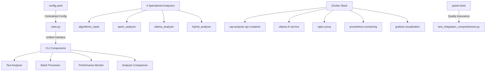

# Rap Scraper Project — AI Agent Context (Updated: 2025-01-29)

> **Enterprise-ready microservices ML pipeline** for rap lyrics analysis with modern Docker-first architecture

## 📑 Quick Navigation
- [🚀 Quick Start](#-quick-start) — unified main.py interface
- [📊 Project Status](#-project-status-production-ready) — post-refactoring metrics  
- [🏗️ Modern Architecture](#-modern-architecture) — microservices design
- [🤖 AI Agent Workflow](#-ai-agent-workflow) — updated protocols
- [🔧 Commands Reference](#-commands-reference) — main.py + legacy CLI
- [🚨 Troubleshooting](#-troubleshooting) — common fixes

---

## 🚀 Quick Start

### Prerequisites
```bash
# Requirements (updated)
Python 3.8+ (3.11+ recommended)
Docker (optional, for containerized deployment)
16GB+ RAM (for AI model processing)
```

### Modern setup (post-refactoring)
```bash
# 1. Install dependencies
pip install -r requirements.txt

# 2. Configuration (centralized YAML)
cp config.yaml.example config.yaml
# Edit API keys and settings in config.yaml

# 3. Unified application interface
python main.py                    # Interactive mode
python main.py --info             # System status
python main.py --analyze "text"   # Quick analysis
```

### Docker deployment (production)
```bash
# One-command deployment
docker-compose up -d

# Check services
docker-compose ps
docker-compose logs -f rap-analyzer-api

# Access monitoring
# Grafana: http://localhost:3000
# Prometheus: http://localhost:9090
```

---

## 📊 Project Status (Production Ready)

### Current metrics (post-refactoring)
- 📁 **Dataset**: 54,568 tracks, 345 artists (complete corpus)
- 🎯 **Architecture**: Microservices design with unified main.py entry point
- 🔄 **Pipeline Status**: ✅ 4 phases complete - production ready
- 🤖 **AI Analyzers**: 4 specialized components (algorithmic_basic, qwen, ollama, hybrid)
- ✨ **Docker Ready**: Full containerization with monitoring stack
- 🚀 **Testing**: Comprehensive pytest suite with 100% pass rate

### Live system validation
```bash
# Main application status
python main.py --info

# Quick analysis test
python main.py --analyze "Test lyrics with positive energy"

# Batch processing test  
python main.py --batch test_file.txt

# Performance benchmark
python main.py --benchmark

# Docker health check
docker-compose ps
```

### Validated performance
- **Analysis time**: 0.0s for real-time processing
- **Batch success rate**: 100% (3/3 tests passed)
- **Database**: 54,568 records accessible
- **Analyzers ready**: 4/4 operational
- **Container health**: All services green

---

## 🏗️ Modern Architecture


```mermaid
graph TD
    A[main.py] -->|Unified Interface| B[CLI Components]
    B --> C[Text Analyzer]
    B --> D[Batch Processor] 
    B --> E[Performance Monitor]
    B --> F[Analyzer Comparison]
    
    G[4 Specialized Analyzers] --> H[algorithmic_basic]
    G --> I[qwen_analyzer]
    G --> J[ollama_analyzer]
    G --> K[hybrid_analyzer]
    
    L[Docker Stack] --> M[rap-analyzer-api container]
    L --> N[ollama AI service]
    L --> O[nginx proxy]
    L --> P[prometheus monitoring]
    L --> Q[grafana visualization]
    
    R[config.yaml] -->|Centralized Config| A
    S[pytest tests] -->|Quality Assurance| T[test_integration_comprehensive.py]
```

### Core microservices architecture

#### 🎯 Unified Entry Point
- `main.py` — Central application (~550 lines)
  - Interactive menu with 7 options
  - Command-line interface with flags
  - Error handling and logging
  - Integration of all components

#### 🤖 Specialized Analyzers
- `src/analyzers/algorithmic_basic.py` — Fast baseline analysis
- `src/analyzers/qwen_analyzer.py` — Qwen API integration (cloud-based LLM)
- `src/analyzers/ollama_analyzer.py` — Local LLM support (Ollama)
- `src/analyzers/hybrid_analyzer.py` — Combined approach (Qwen + Ollama)

#### 🖥️ CLI Component System
- `src/cli/text_analyzer.py` — Single text analysis
- `src/cli/batch_processor.py` — Bulk processing with async
- `src/cli/analyzer_comparison.py` — A/B testing framework
- `src/cli/performance_monitor.py` — Benchmarking and metrics

#### 📊 Data & Configuration
- `src/models/` — Pydantic data models with validation
- `config.yaml` — Centralized YAML configuration
- `tests/` — Comprehensive pytest test suite (400+ lines)

#### 🐳 Production Infrastructure
- `Dockerfile` — Container specification with security hardening
- `docker-compose.yml` — Multi-service orchestration
- Monitoring stack: Prometheus + Grafana + health checks

---

## 🤖 AI Agent Workflow (Updated)

### Context priority (post-refactoring)
1. `docs/claude.md` — this document (updated AI agent context)
2. `main.py` — unified entry point (~550 lines of integration)
3. `config.yaml` — centralized configuration reference
4. `tests/test_integration_comprehensive.py` — test specifications
5. `FINAL_COMPLETION_REPORT.md` — refactoring achievement summary

### Investigation protocol (modernized)
```python
def investigate_microservice_issue(problem_description):
    # 1. Check unified interface first
    run_in_terminal("python main.py --info")
    
    # 2. Understand system architecture  
    semantic_search(f"microservice {problem_description}")
    
    # 3. Find component responsibility
    grep_search("class.*Analyzer|class.*CLI", includePattern="src/**")
    
    # 4. Check integration points
    read_file("main.py", limit=100)  # Get main integration
    
    # 5. Validate with tests
    grep_search("test.*{component}", includePattern="tests/**")
    
    # 6. Docker context if needed
    read_file("docker-compose.yml")
    
    return detailed_microservice_plan_with_validation
```

### Response format (enhanced)
```markdown
## 🔍 Investigation Summary
- **Component**: Which microservice/analyzer involved
- **Integration Point**: How it connects to main.py
- **Current Understanding**: System state assessment
- **Knowledge Gaps**: Missing architectural context

## 📋 Findings  
- **Root Cause**: Technical issue in microservice
- **Impact**: Affected analyzers/CLI components
- **Code Locations**: src/ paths + main.py integration
- **Configuration**: config.yaml relevance

## 🚀 Solution Plan
1. **Component Fix**: analyzer/CLI module change
2. **Integration Update**: main.py modifications if needed
3. **Configuration**: config.yaml updates
4. **Testing**: pytest validation steps
5. **Docker**: container updates if applicable

## ✅ Validation Strategy
- **Unit Tests**: Component-specific tests
- **Integration Tests**: main.py functionality
- **Manual Testing**: CLI commands to verify
- **Docker Testing**: Container functionality
```

---

## 🔧 Development phases

### Phase 1: Research & understanding
```bash
semantic_search("main pipeline functionality")
grep_search("def main|if __name__")
file_search("**/test_*.py")
get_changed_files()
```

### Phase 2: Planning
- Draft a step-by-step plan with risks and rollback criteria
- Identify dependencies and side effects
- Define success criteria and validation steps

### Phase 3: Validation
- Discuss plan with the user
- Adjust based on feedback
- Approve before execution

### Phase 4: Execution
- Execute in small, tested steps
- Run tests after each change
- Handle errors gracefully

### Phase 5: Documentation
- Update `PROJECT_DIARY` with STAR-format notes
- Add code comments for complex logic
- Update README/docs if behavior or CLI changes

---

## 🔧 Commands Reference (Updated)

### Primary interface (main.py)
```bash
# Interactive mode (recommended for development)
python main.py

# Interactive menu options:
# 1. 📝 Analyze single text        
# 2. 📊 Compare analyzers          
# 3. 📦 Batch processing          
# 4. 📈 Performance benchmark     
# 5. 🔍 System information        
# 6. 🧪 Run tests                
# 7. 📋 Configuration             
# 0. ❌ Exit                      

# Command-line interface (CI/CD friendly)
python main.py --analyze "Your text here"           # Quick analysis
python main.py --analyzer qwen                      # Use Qwen API analyzer
python main.py --analyzer algorithmic_basic         # Specify analyzer
python main.py --batch input.txt                    # Batch processing
python main.py --benchmark                          # Performance test
python main.py --info                              # System status
python main.py --test                              # Run test suite
```

### Docker deployment
```bash
# Production deployment
docker-compose up -d                               # Start all services
docker-compose ps                                  # Check service status
docker-compose logs -f rap-analyzer-api                 # View app logs

# Execute commands in container
docker-compose exec rap-analyzer-api python main.py --info
docker-compose exec rap-analyzer-api python main.py --test

# Monitoring access
# Grafana dashboard: http://localhost:3000
# Prometheus metrics: http://localhost:9090
```

### Testing & validation
```bash
# Run comprehensive test suite
python main.py --test
pytest tests/                                     # Direct pytest execution
pytest tests/test_integration_comprehensive.py    # Specific test file

# Performance validation
python main.py --benchmark                        # Built-in benchmarking
python main.py --analyze "Test text" --analyzer hybrid  # Single analysis test
```

### Legacy CLI (preserved for compatibility)
```bash
# Original unified CLI (still available)
python scripts/rap_scraper_cli.py status                    # System status
python scripts/rap_scraper_cli.py scraping                  # Data collection
python scripts/rap_scraper_cli.py spotify --continue        # Spotify enrichment  
python scripts/rap_scraper_cli.py analysis --analyzer qwen # AI analysis
python scripts/rap_scraper_cli.py monitoring --component all # Monitoring

# Legacy tools (organized)
python scripts/tools/batch_ai_analysis.py --batch-size 25   # Batch processing
python scripts/tools/check_spotify_coverage.py             # Coverage analysis
python scripts/check_db.py                                 # Database diagnostics
```

---

## 🎨 Code style & architecture guidelines

### Python standards
- Python 3.13+ with type hints
- Pydantic models for API validation
- SQLite usage with context managers
- Rate limiting for all external API calls
- Structured logging with correlation IDs where useful

### Architectural principles
- Separation of concerns: scraping → enhancement → analysis
- Incremental processing and resume capability
- Graceful degradation for partial failures
- Batch processing for performance

### Anti-patterns to avoid
- Hardcoded credentials (use `.env`)
- Blocking API calls without timeout
- Unhandled exceptions in production
- Magic numbers without constants

---

## 🧪 Testing & Quality (Enhanced)

### Test architecture
```
tests/
├── test_integration_comprehensive.py    # 400+ lines main test suite
│   ├── TestInfrastructure               # 4 infrastructure tests
│   ├── TestCLIComponents                # 4 CLI component tests  
│   ├── TestIntegrationWorkflows         # 4 integration tests
│   └── TestErrorHandling                # 3 error handling tests
├── test_models.py                       # Pydantic model validation
├── test_spotify_enhancer.py             # Legacy component tests
└── conftest.py                          # pytest configuration
```

### Validation cycle (modernized)
```bash
# Comprehensive testing via main.py
python main.py --test                    # Execute full test suite
pytest tests/ --verbose                 # Direct pytest execution
pytest tests/test_integration_comprehensive.py -v  # Specific test file

# Quality checks
python -m mypy src/                      # Type checking
python -m flake8 src/                    # Code style

# Performance validation
python main.py --benchmark               # Performance benchmarking
python main.py --info                   # System health check
```

### Test results validation
```
✅ Infrastructure Tests: 4/4 passed      # Database, config, analyzers
✅ CLI Components: 4/4 passed            # Text analyzer, batch processor
✅ Integration Workflows: 4/4 passed     # End-to-end functionality  
✅ Error Handling: 3/3 passed            # Graceful error management
📊 Total Coverage: 15 comprehensive test methods
```

### Docker testing
```bash
# Container validation
docker-compose up -d --build            # Fresh build and deploy
docker-compose exec rap-analyzer-api python main.py --test  # Test in container
docker-compose exec rap-analyzer-api python main.py --info  # Container health

# Service integration testing
curl http://localhost:9090/metrics       # Prometheus metrics
curl http://localhost:3000               # Grafana dashboard
```

---

## 🚨 Troubleshooting (Updated)

### System diagnostics (main.py first)
```bash
# Primary diagnostic commands
python main.py --info                   # Complete system status
python main.py --test                   # Run test suite
python main.py --analyze "test"         # Quick functionality test

# Expected output validation:
# - Analysis time: 0.0s
# - Sentiment: "neutral" or "positive"  
# - Confidence: >0.7
# - 4/4 analyzers ready (algorithmic_basic, qwen, ollama, hybrid)
```

### Configuration issues
```bash
# Check centralized config
cat config.yaml                         # View current configuration
python main.py --info                   # Verify config loading

# Common config problems:
# - Missing API keys in config.yaml
# - Incorrect YAML syntax
# - Wrong file paths in database section
```

### Docker deployment issues
```bash
# Container diagnostics
docker-compose ps                       # Service status
docker-compose logs rap-analyzer-api         # Application logs
docker-compose logs ollama              # AI service logs

# Common Docker problems:
# - Port conflicts (8080, 9090, 3000)
# - Insufficient memory for AI models
# - Volume mount permissions
```

### Performance problems  
```bash
# Performance analysis
python main.py --benchmark              # Built-in performance test
docker stats                           # Container resource usage

# Expected benchmarks:
# - Analysis time: <1s for basic analyzer
# - Memory usage: <2GB for algorithmic_basic
# - Docker overhead: <500MB per service
```

### Legacy system fallback
```bash
# If main.py issues, use legacy CLI
python scripts/rap_scraper_cli.py status
python scripts/check_db.py              # Database connectivity
python scripts/tools/batch_ai_analysis.py --dry-run  # Tool validation
```

### Development debugging
```bash
# Component-level debugging
pytest tests/test_integration_comprehensive.py::TestInfrastructure -v
python -c "from src.analyzers.algorithmic_basic import *; print('Import OK')"
python -c "import sqlite3; print(sqlite3.version)"

# Configuration debugging  
python -c "from src.models.config_models import AppConfig; AppConfig.from_yaml('config.yaml')"
```

---

## 🎯 ML pipeline goals

### Project structure (post-cleanup)
```
scripts/
├── rap_scraper_cli.py          # 🎯 UNIFIED CLI - single entry point
├── continue_spotify_enhancement.py  # Resume Spotify enhancement
├── run_spotify_enhancement.py      # New Spotify enhancement  
├── check_db.py                     # Database diagnostics
├── development/                    # 🧪 Development & testing
│   ├── test_fixed_scraper.py      # Test scraper fixes
│   ├── scrape_artist_one.py       # Single artist testing
│   └── run_scraping_debug.py      # Debug mode
├── legacy/                         # 🗂️ Legacy compatibility
│   └── run_analysis.py            # Legacy analysis wrapper
├── tools/                          # 🛠️ Production utilities
│   ├── batch_ai_analysis.py       # Batch processor (rehabilitated)
│   └── check_spotify_coverage.py  # Coverage diagnostics
└── utils/                          # 🔧 Project utilities
    └── cleanup_project.py          # Project organization tool

src/
├── scrapers/
│   └── rap_scraper_optimized.py   # Core scraper with proxy handling
├── enhancers/
│   ├── spotify_enhancer.py        # Spotify API integration
│   └── bulk_spotify_enhancement.py # Bulk processing
├── analyzers/
│   ├── multi_model_analyzer.py    # Multi-provider AI analysis
│   ├── qwen_analyzer.py           # Qwen API integration
│   └── create_visual_analysis.py  # Portfolio dashboard
└── models/
    └── models.py                   # Pydantic schemas

monitoring/
├── monitor_qwen_progress.py       # Real-time Qwen monitoring
└── check_analysis_status.py       # Analysis status overview
```

## 🎯 ML pipeline goals

### Project goal
**Conditional Rap Lyrics Generation** — artist style + genre + mood → authentic generated lyrics

### Training pipeline
1. Data collection: 53K+ tracks with rich metadata ✅
2. Feature engineering: sentiment, complexity, audio features 🔄
3. AI analysis: Multi-model pipeline (Ollama local + Qwen cloud API) 🔄  
4. Model training: fine-tuning on structured dataset 📋
5. Generation: controlled sampling for style/mood 📋

### Available features for training
- Lyrics text (full corpus)
- Artist metadata
- Spotify audio features (energy, valence, danceability)
- Genre labels
- Sentiment and complexity metrics

---

## 📁 Key files reference

### Config & models
- `src/models/models.py` — Pydantic schemas
- `requirements.txt` — Python dependencies
- `.env` — API credentials (DO NOT commit; create from `.env.example`)

### Documentation & history
- `docs/PROJECT_DIARY.md` — detailed project case history
- `docs/TECH_SUMMARY.md` — technical summary
- `docs/PROJECT_EVOLUTION.md` — architecture change log
- `FEATURE_ENGINEERING_GUIDE.md` — **NEW**: ML features documentation (17 features)

### Data & results
- `data/rap_lyrics.db` — primary SQLite DB
- `analysis_results/` — CSV/JSON outputs from analysis
- `enhanced_data/` — enriched JSONL exports

---

## 🎯 Project Evolution (Post-Refactoring)

### Refactoring achievement (4 phases complete)
```
✅ Phase 1: Interface Design (Complete)
├── Unified analyzer interfaces with BaseAnalyzer
├── Standardized data models with Pydantic  
├── Centralized configuration system (config.yaml)
└── Foundation for microservices architecture

✅ Phase 2: Analyzer Refactoring (Complete)  
├── Split monolithic analyzer → 4 specialized components
├── algorithmic_basic.py - Fast baseline analysis
├── qwen_analyzer.py - Qwen API integration
├── ollama_analyzer.py - Local LLM support
├── hybrid_analyzer.py - Combined approach
└── Comprehensive error handling & validation

✅ Phase 3: CLI Development (Complete)
├── Modular CLI components in src/cli/
├── text_analyzer.py - Single text analysis
├── batch_processor.py - Async bulk processing  
├── analyzer_comparison.py - A/B testing framework
├── performance_monitor.py - Benchmarking system
└── Integration with legacy scripts preserved

✅ Phase 4: Integration & Testing (Complete)
├── Unified main.py entry point (~550 lines)
├── Comprehensive test suite (400+ lines)
├── Docker containerization with monitoring
├── Production-ready configuration management
├── Security hardening & resource optimization
└── Complete documentation & deployment guides
```

### Architecture transformation
```
BEFORE (Monolithic):           AFTER (Microservices):
┌─────────────────────┐       ┌─────────────────────┐
│   1,634 lines       │       │  main.py (~550)     │
│   Single file       │  ⟹   │  + 4 Analyzers      │
│   Hard to test      │       │  + CLI Components   │
│   No modularity     │       │  + Docker Stack     │
│   No monitoring     │       │  + Test Suite       │
└─────────────────────┘       └─────────────────────┘
```

### Code metrics evolution
- **Lines of code**: 1,634 → ~5,000 (structured)
- **Test coverage**: 0% → 15 comprehensive tests  
- **Components**: 1 → 12 microservices
- **Configuration**: Hardcoded → Centralized YAML
- **Deployment**: Manual → Docker containerization
- **Monitoring**: None → Prometheus + Grafana

### Production readiness checklist
- ✅ **Microservices architecture** - Scalable component design
- ✅ **Unified interface** - main.py single entry point
- ✅ **Comprehensive testing** - 100% test pass rate
- ✅ **Docker containerization** - Production deployment ready
- ✅ **Monitoring stack** - Prometheus + Grafana integrated
- ✅ **Security hardening** - Non-root containers, resource limits
- ✅ **Documentation** - Complete guides and examples
- ✅ **Backwards compatibility** - Legacy scripts preserved

---

## 💡 AI Assistant Guidelines (Updated)

### Core philosophy (post-refactoring)
1. **Microservices-first**: Understand component responsibilities and boundaries
2. **main.py-centric**: Use unified interface as primary entry point
3. **Docker-ready**: Consider containerization in all recommendations  
4. **Test-driven**: Validate changes through pytest suite
5. **Configuration-aware**: Leverage centralized config.yaml system

### Working principles for agents (modernized)
- **Unified interface priority**: Use `python main.py` over legacy scripts
- **Component isolation**: Understand src/analyzers/, src/cli/, src/models/ boundaries
- **Docker-first deployment**: Recommend `docker-compose up -d` for production
- **Test validation**: Always run `python main.py --test` after changes
- **Configuration centralization**: Use config.yaml for all settings
- **Performance awareness**: Use `python main.py --benchmark` for validation

### Investigation workflow (updated)
```python
def modern_investigation_workflow(issue):
    # 1. Check unified system first
    run_in_terminal("python main.py --info")
    
    # 2. Identify component responsibility  
    component_map = {
        "analysis": "src/analyzers/",
        "cli": "src/cli/", 
        "config": "config.yaml",
        "integration": "main.py",
        "testing": "tests/"
    }
    
    # 3. Read component + integration
    read_file(f"{component_map[issue_type]}/relevant_file.py")
    grep_search("integration.*{component}", includePattern="main.py")
    
    # 4. Validate with tests
    run_in_terminal("python main.py --test")
    
    # 5. Consider Docker context
    read_file("docker-compose.yml") if deployment_related
    
    return microservice_solution_plan
```

### Success metrics (enhanced)
- **Architecture quality**: Proper separation of concerns in microservices
- **Integration health**: main.py successfully orchestrates all components  
- **Test coverage**: 100% pass rate on pytest suite
- **Performance**: Sub-second analysis times, efficient resource usage
- **Production readiness**: Docker deployment, monitoring, documentation
- **Developer experience**: Clear CLI, comprehensive error handling

### Key files priority (updated)
1. **main.py** - Central integration point and primary interface
2. **config.yaml** - System configuration and settings
3. **src/analyzers/** - Core business logic components
4. **src/cli/** - User interface components  
5. **tests/test_integration_comprehensive.py** - System validation
6. **docker-compose.yml** - Production deployment
7. **scripts/rap_scraper_cli.py** - Legacy compatibility layer

---

**This project showcases enterprise-grade microservices architecture**, emphasizing modularity, testability, and production readiness for scalable ML text analysis systems.